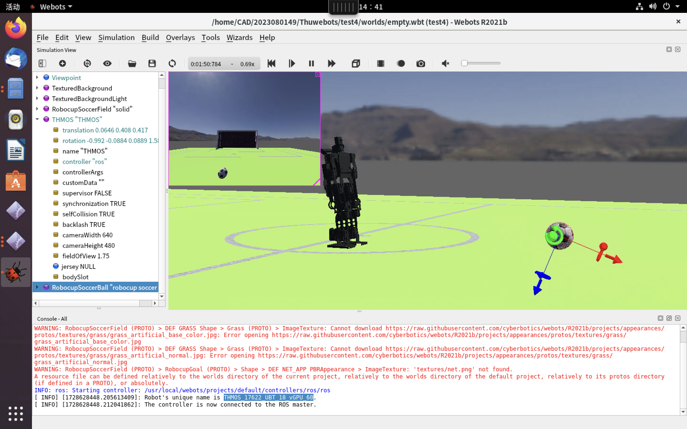
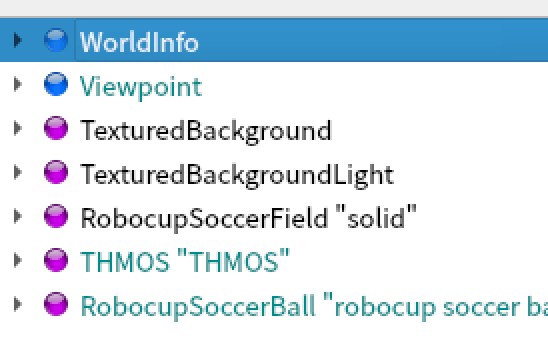
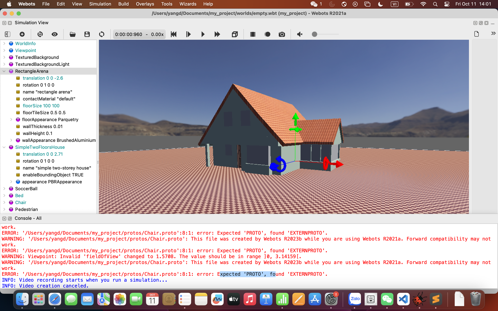
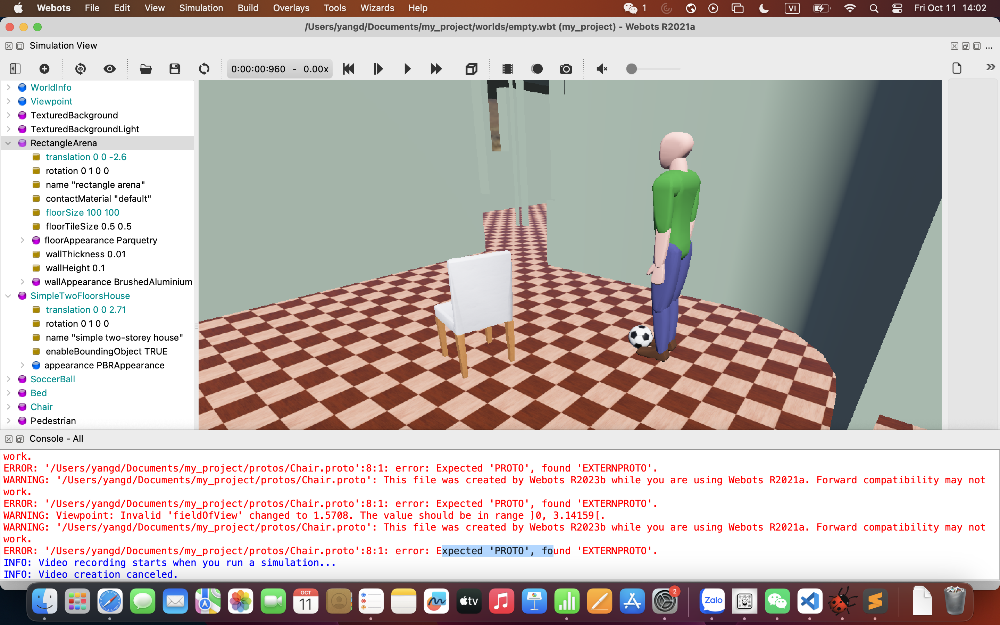
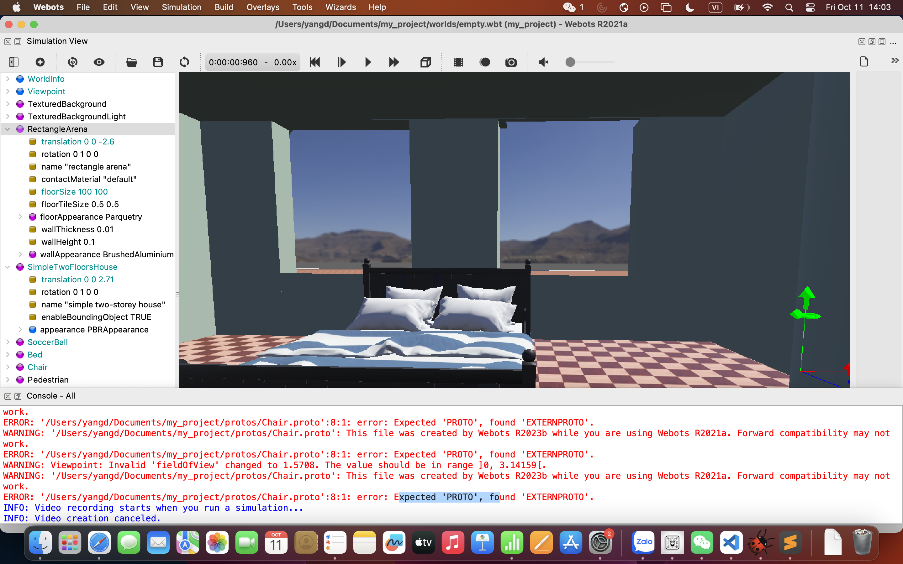
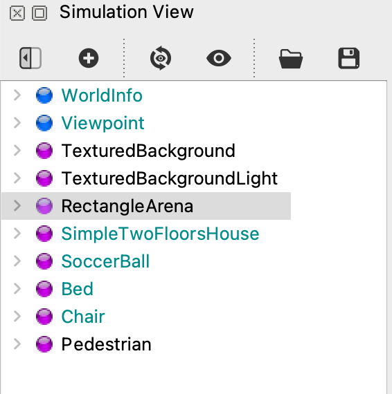

# WEBOTS HOMEWORK
## PROBLEM 1
> 按照教程建立足球机器人仿真环境，理解场景树各项的含义。参考课件最后几页，通过webots_ros功能包（标准ros控制器）使能相机。
### 1. WEBOTS界面截图

### 2. 场景树结构

1. **WorldInfo**: 
   - Contains metadata and general settings for the simulation environment.

2. **Viewpoint**: 
   - Sets the camera angle and perspective for viewing the soccer simulation.

3. **TexturedBackground**: 
   - Provides a visual backdrop, enhancing the realism of the scene.

4. **TexturedBackgroundLight**: 
   - Adds lighting effects to improve the visual depth and clarity of the background.

5. **RobocupSoccerField "solid"**: 
   - Represents the soccer field, likely with physical properties set to "solid" for realistic interactions.

6. **THMOS "THMOS"**: 
   - The THUMOS robot, designed to play soccer. It likely includes components for movement, ball interaction, and strategy execution.

7. **RobocupSoccerBall "robocup soccer ball"**: 
   - The soccer ball used in the simulation, likely with properties to simulate real-world physics and interactions with the robot.
  
## PROBLEM 2
> 建立一个自己的webots世界，如包含地面、桌子、椅子的房间，可利用 webots 已有资源，实操实体建模、组合体建模等操作
### 1. 房间

### 2. 人 - 椅子 - 球 

### 3. 卧室

### 4. 场景树结构

1. **WorldInfo**: 
   - Contains general information about the simulation world.

2. **Viewpoint**: 
   - Defines the camera position and orientation for viewing the simulation.

3. **TexturedBackground**: 
   - Provides a background texture for the scene.

4. **TexturedBackgroundLight**: 
   - Adds lighting effects to the textured background.

5. **RectangleArena**: 
   - Represents a rectangular area, possibly the main environment or playing field.

6. **SimpleTwoFloorsHouse**: 
   - A model of a house with two floors, likely for architectural or navigational purposes.

7. **SoccerBall**: 
   - An object representing a soccer ball, possibly for physics or interaction simulations.

8. **Bed**: 
   - A model of a bed, indicating interior furnishing or a specific setting.

9. **Chair**: 
   - Represents a chair, adding to the interior elements of the simulation.

10. **Pedestrian**: 
    - A model of a person, used for simulating human movement or interactions.